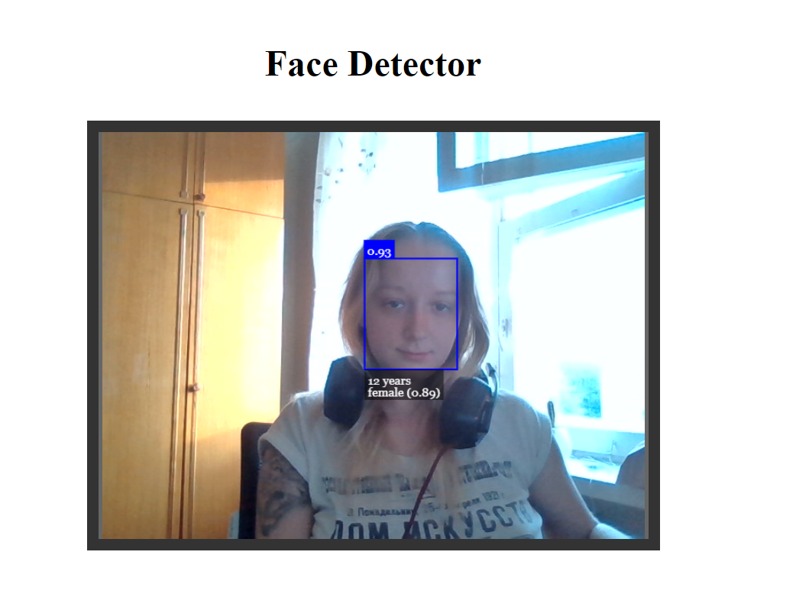

# Face Detector
The app detects a gender and predicted age from a webcam stream.

## Notice
This software uses [face-api.js](https://github.com/justadudewhohacks/face-api.js) library by Vincent Mühler.

## Demo


## Setting up the environment
- Python3 installation is required
- run `npm i`
### Windows
- You may be need to complete [these steps](https://github.com/nodejs/node-gyp#on-windows) for running on Windows.
In case of any problems with `node-gyp` refer to the above guidline.
- If the guide didn't help try [this one](https://github.com/nodejs/node-gyp/blob/main/docs/Updating-npm-bundled-node-gyp.md)
### Environment variables
```
NODE_ENV=dev|production
PORT=3000
```

## Run
### Dev mode
1. Run `npm run fe:watch`
2. Run `npm run be:watch`
3. Open [http://localhost:<PORT>/](http://localhost:<PORT>/) in your browser

### Production mode
1. Run `npm run start`
2. Open [http://localhost:<PORT>/](http://localhost:<PORT>/) in your browser